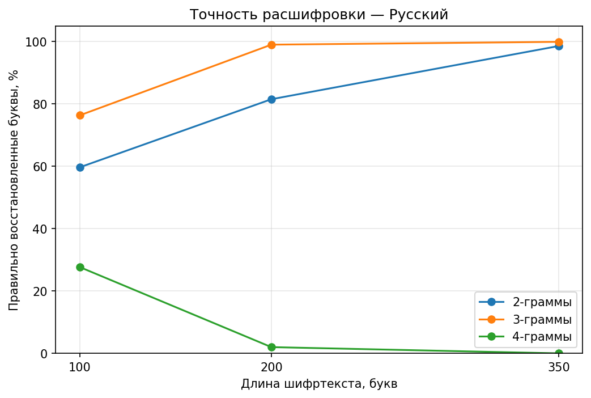
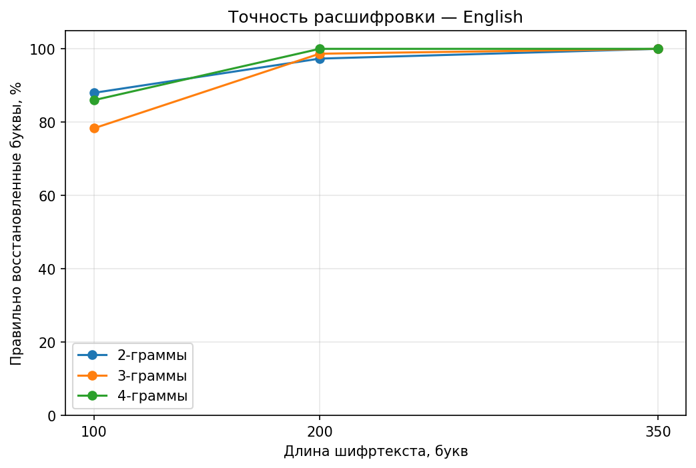

# ML Encrypto Project

Учебный проект для автоматического взлома шифра простой моноалфавитной замены на русском и английском языках.

Программа оценивает варианты расшифровки с помощью символьной языковой модели. Начальный ключ строится по частотам букв, затем улучшается методом имитации отжига. Для экспериментов обучаются 2-, 3- и 4-граммные модели; терминальная программа по умолчанию использует 3-граммную.

## Возможности

- расшифровка русского и английского текста с неизвестным ключом;
- шифрование и расшифровка по известному ключу через функции проекта;
- обучение языковых моделей на корпусах Википедии;
- сохранение моделей для повторного использования;
- ввод многострочного шифртекста в терминале;
- вывод найденного текста, ключа, оценки модели и времени поиска;
- сравнение 2-, 3- и 4-граммных моделей на текстах разной длины;
- графики результатов в Jupyter Notebook;
- автоматические тесты.

## Как работает расшифровка

```text
Выбор языка и загрузка обученной модели
                    ↓
             Ввод шифртекста
                    ↓
      Начальный ключ по частотам букв
                    ↓
     Перестановки букв в вариантах ключа
                    ↓
   Оценка расшифровок языковой моделью
                    ↓
 Имитация отжига с несколькими перезапусками
                    ↓
       Лучший найденный текст и ключ
```

Языковая модель оценивает, насколько сочетания символов похожи на текст из обучающего корпуса. Её оценка — средняя логарифмическая вероятность, а не процент правильных букв.

Имитация отжига принимает улучшения и иногда допускает ухудшения. Это помогает поиску выходить из локальных максимумов. По мере снижения температуры вероятность принять ухудшение уменьшается.

## Структура проекта

```text
ML_Encrypto_project/
├── data/
│   ├── wikipedia_ru.txt             # скачиваемый корпус
│   ├── wikipedia_en.txt             # скачиваемый корпус
│   ├── evaluation_ru_1.txt          # тексты для проверки качества
│   ├── evaluation_ru_2.txt
│   ├── evaluation_ru_3.txt
│   ├── evaluation_en_1.txt
│   ├── evaluation_en_2.txt
│   └── evaluation_en_3.txt
├── models/
│   ├── ru_model_2_gramm.pkl         # создаются при обучении
│   ├── ru_model_3_gramm.pkl
│   ├── ru_model_4_gramm.pkl
│   ├── en_model_2_gramm.pkl
│   ├── en_model_3_gramm.pkl
│   └── en_model_4_gramm.pkl
├── graphic/
│   ├── array.pkl                    # результаты бенчмарка
│   ├── evaluation_graphic.ipynb     # ноутбук с графиками
│   ├── accuracy_ru.png
│   └── accuracy_en.png
├── src/
│   ├── __init__.py
│   ├── cipher.py                    # шифрование и работа с ключом
│   ├── evaluation.py                # точность по буквам
│   ├── languages.py                 # настройки языков
│   ├── model_storage.py             # сохранение и загрузка моделей
│   ├── ngram_model.py               # языковая модель
│   ├── solver.py                    # поиск ключа
│   └── text_processing.py           # нормализация текста
├── tests/
│   ├── test_cipher.py
│   ├── test_download_corpus.py
│   ├── test_evaluation.py
│   ├── test_languages.py
│   ├── test_main.py
│   ├── test_model_storage.py
│   ├── test_ngram_model.py
│   ├── test_solver.py
│   └── test_text_processing.py
├── benchmark.py                     # эксперимент с качеством
├── download_corpus.py               # скачивание корпусов
├── main.py                          # терминальная программа
├── train_models.py                  # обучение моделей
├── requirements.txt
├── .gitignore
└── README.md
```

Корпусы `wikipedia_*.txt` и обученные модели из папки `models/` не хранятся в Git. После клонирования проекта их нужно подготовить локально. Проверочные тексты и сохранённые результаты бенчмарка находятся в репозитории.

## Требования

- Python 3.10 или новее;
- доступ к интернету при первоначальном скачивании корпусов.

Проект разрабатывался и проверялся на Python 3.13.

## Установка

```bash
git clone https://github.com/Tim2la/ML_Encrypto_project.git
cd ML_Encrypto_project
python3 -m venv .venv
source .venv/bin/activate
python -m pip install -r requirements.txt
```

Команда активации выше подходит для macOS и Linux.

## Подготовка корпусов

Скачать оба корпуса:

```bash
python download_corpus.py --language all
```

По умолчанию скачивается около 10 миллионов символов для каждого языка. Можно изменить объём:

```bash
python download_corpus.py --language en --target-characters 1000000
```

После загрузки появятся `data/wikipedia_ru.txt` и `data/wikipedia_en.txt`.

## Обучение моделей

После скачивания **обоих** корпусов запусти:

```bash
python train_models.py
```

Скрипт обучит по три модели для каждого языка с `n=2`, `n=3` и `n=4`. Файлы сохраняются под именами вида `models/ru_model_3_gramm.pkl`. При обычном запуске расшифровки обучение не повторяется.

Если изменился корпус или параметры модели, запусти обучение снова.

## Запуск программы

```bash
python main.py
```

Выбери язык шифртекста:

```text
1 — Русский
2 — English
```

Вставь шифртекст. Для завершения многострочного ввода отправь пустую строку. Программа покажет найденную расшифровку, ключ замены, оценку модели и время поиска.

Для более устойчивого результата лучше использовать длинный шифртекст: короткие тексты могут давать серьёзные ошибки.

## Проверка качества

Запусти бенчмарк:

```bash
python benchmark.py
```

Он берёт по три отдельных текста для каждого языка. Из каждого текста выбираются отрывки длиной 100, 200 и 350 букв. Затем создаётся воспроизводимый случайный ключ, текст шифруется, расшифровывается и сравнивается с исходником.

Для каждого сочетания языка, размера граммы и длины выполняются три запуска — по одному на каждый текст. Всего получается 54 запуска: 2 языка × 3 модели × 3 длины × 3 текста. Бенчмарк выводит:

- точность по буквам;
- количество полностью восстановленных текстов;
- время поиска.

Средние результаты сохраняются в `graphic/array.pkl`. В каждой строке находятся код языка, `n`, число букв, средняя точность в процентах, число полностью восстановленных текстов и среднее время в секундах. Время зависит от компьютера. Полный бенчмарк может занять несколько минут.

### Сравнение моделей

В таблице указаны средняя точность букв и, в скобках, число полностью восстановленных текстов из трёх.

| Язык | n | 100 букв | 200 букв | 350 букв |
|---|---:|---:|---:|---:|
| Русский | 2 | 59,67% (0/3) | 81,50% (0/3) | 98,57% (1/3) |
| Русский | 3 | 76,33% (0/3) | 99,00% (1/3) | 99,90% (2/3) |
| Русский | 4 | 27,67% (0/3) | 2,00% (0/3) | 0,00% (0/3) |
| English | 2 | 88,00% (0/3) | 97,33% (1/3) | 100,00% (3/3) |
| English | 3 | 78,33% (0/3) | 98,67% (2/3) | 100,00% (3/3) |
| English | 4 | 86,00% (2/3) | 100,00% (3/3) | 100,00% (3/3) |





Русская 4-граммная модель оценивает правильный текст выше найденных ошибочных вариантов, но при текущих настройках поиск ключа часто не достигает этого варианта. Поэтому основная программа пока использует 3-граммную модель для обоих языков.

Тексты для проверки написаны отдельно от корпуса Википедии. Набор пока небольшой: три текста на язык и один ключ для каждого текста. Отрывки разной длины взяты из начала одних и тех же текстов. Эти числа описывают данный эксперимент и не гарантируют такой же точности на любом новом шифртексте.

### Графики в ноутбуке

Открой `graphic/evaluation_graphic.ipynb` в Jupyter или VS Code и выполни ячейки. Ноутбук читает `graphic/array.pkl` и сохраняет графики рядом с ним. Для выбранного ядра Python требуется Matplotlib; если пакет отсутствует, установи его в это ядро командой `python -m pip install matplotlib`.

## Тесты

```bash
python -m pytest -q
```

На текущем этапе проходят 33 теста.

## Ограничения

- Поддерживается только простая моноалфавитная замена.
- Пробелы и знаки препинания предполагаются незашифрованными.
- Короткие тексты могут расшифровываться значительно хуже длинных.
- Качество зависит от обучающего корпуса и настроек поиска.
- Редкие буквы могут восстанавливаться неправильно.
- Найденный вариант не гарантирует точного совпадения с исходным текстом.

## План развития

- расширить набор проверочных текстов и ключей;
- исследовать способы улучшить поиск ключа с русской 4-граммной моделью;
- сравнить настройки имитации отжига;
- улучшить качество на коротких текстах;
- создать API для расшифровки;
- подключить Telegram-бота;
- при необходимости добавить MCP-инструмент для AI-агентов.

## Цель проекта

Проект помогает изучить Python, тестирование, статистические языковые модели и методы комбинаторной оптимизации на практической задаче криптоанализа.

Это учебный проект; он не предназначен для взлома современных криптографических алгоритмов.
